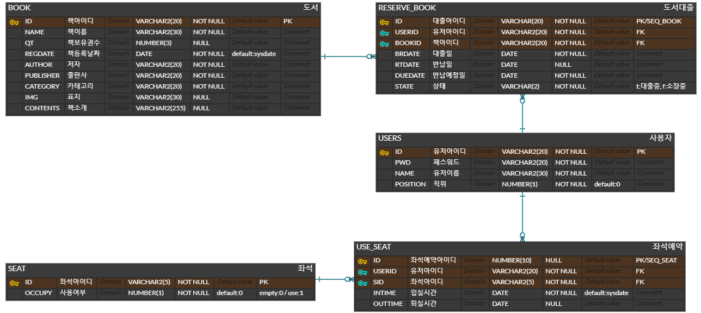

# DOOKLibrary

## 프로젝트 배경

- 대학교 스마트 도서관 시스템 구축

#### 프로젝트 목적

- 대학 도서관을 외부에서 간단하게 사용할 수 있는 시스템
- 도서 검색 및 대여, 열람실 배정 등 온라인으로 이용 가능하여 도서관 이용자들에게 편리함을 제공
- 하나의 시스템으로 도서관을 관리할 수 있어 사서의 업무의 효율을 향상

#### 개발환경

| 분류      |                                                         |
| --------- | ------------------------------------------------------- |
| Front-End | `HTML5`, `CSS3.0`, `JavaScript`, `jQuery`, `Bootstrap`  |
| Back-End  | `Java`, `Apache Tomcat 9`, `Spring`, `MyBatis`, `Maven` |
| DataBase  | `Oracle Database 11g Express Edition`                   |
| etc       | `open date api (동네예보조회)`                          |

#### 구성도

#### ERD

